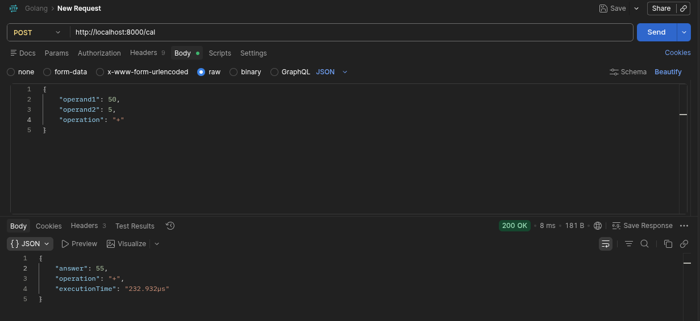

# 🧮 Calculator Service API


A lightweight **RESTful Calculator Service** built using **Golang** and the **Gin Web Framework**. This project was developed to practice backend engineering principles such as layered architecture, separation of concerns, request validation, structured error handling, and clean API design.

---

# 📖 Table of Contents

- [Overview](#-overview)
- [Features](#-features)
- [Tech Stack](#-tech-stack)
- [Project Structure](#-project-structure)
- [Architecture](#-architecture)
- [API Endpoint](#-api-endpoint)
- [Request & Response](#-request--response)
- [Error Handling](#-error-handling)
- [API Demo](#-api-demo)
- [Running the Project](#-running-the-project)
- [Testing](#-testing)
- [Future Improvements](#-future-improvements)
- [Learning Outcomes](#-learning-outcomes)

---

# 📌 Overview

Many internal teams rely on spreadsheets or manual calculations for simple arithmetic operations, leading to repetitive work and inconsistent results.

This project provides a centralized Calculator API that other internal services can consume to perform arithmetic operations through HTTP requests.

The service is intentionally simple but follows production-oriented backend architecture.

---

# ✨ Features

- ➕ Addition
- ➖ Subtraction
- ✖️ Multiplication
- ➗ Division
- RESTful API
- JSON Request & Response
- Layered Architecture
- Structured Error Responses
- Execution Time Measurement
- Lightweight & Stateless

---

# 🚀 Tech Stack

| Technology | Purpose |
|------------|---------|
| Go | Programming Language |
| Gin | HTTP Web Framework |
| JSON | Data Exchange |
| Postman | API Testing |

---

# 📂 Project Structure

```text
calculator/
│
├── assets/
│   └── calculator_api_demo.png
│
├── cmd/
│   └── api/
│       └── main.go
│
├── internal/
│   ├── handler/
│   ├── routes/
│   └── service/
│
├── go.mod
├── go.sum
└── README.md
```

---

# 🏗️ Architecture

```
                HTTP Request
                      │
                      ▼
                Gin Router
                      │
                      ▼
                 HTTP Handler
                      │
                      ▼
              Calculator Service
                      │
             Business Logic
                      │
                      ▼
                 HTTP Handler
                      │
                      ▼
                JSON Response
```

## Responsibilities

### Router

- Registers application routes.
- Directs incoming requests to handlers.

### Handler

- Parses incoming JSON.
- Validates requests.
- Calls the service layer.
- Handles errors.
- Returns HTTP responses.

### Service

- Contains business logic.
- Performs arithmetic operations.
- Returns calculation results.
- Independent of HTTP/Gin.

---

# 🌐 API Endpoint

## Calculate

**POST**

```
/cal
```

---

# 📥 Request

### Headers

```
Content-Type: application/json
```

### Request Body

```json
{
    "operand1": 50,
    "operand2": 5,
    "operation": "+"
}
```

---

# 📤 Successful Response

```json
{
    "answer": 55,
    "operation": "+",
    "executionTime": "232.932µs"
}
```

---

# Supported Operations

| Operator | Description |
|----------|-------------|
| + | Addition |
| - | Subtraction |
| * | Multiplication |
| / | Division |

---

# ❌ Error Handling

### Division By Zero

```json
{
    "error": "Cannot Divide By Zero"
}
```

---

### Invalid Operator

```json
{
    "error": "Invalid operator"
}
```

---

### Invalid JSON

```json
{
    "error": "invalid character 'a' looking for beginning of value"
}
```

---

# 📷 API Demo

The screenshot below demonstrates a successful API request using Postman.

### Request

```json
{
    "operand1": 50,
    "operand2": 5,
    "operation": "+"
}
```

### Response

```json
{
    "answer": 55,
    "operation": "+",
    "executionTime": "232.932µs"
}
```

### Postman Demo



---

# ⚙️ Running the Project

Clone the repository

```bash
git clone https://github.com/<your-username>/calculator.git
```

Navigate into the project

```bash
cd calculator
```

Install dependencies

```bash
go mod tidy
```

Run the application

```bash
go run ./cmd/api
```

Server starts on

```
http://localhost:8000
```

---

# 🧪 Testing

The API was tested using **Postman**.

### Happy Path Tests

- ✅ Addition
- ✅ Subtraction
- ✅ Multiplication
- ✅ Division

### Error Tests

- ✅ Division by Zero
- ✅ Invalid Operator
- ✅ Invalid JSON
- ✅ Incorrect Data Types

---

# 📈 Future Improvements

- Scientific Calculator
- Multiple Operand Support
- Expression Parsing (`10 + 20 * 5`)
- Request Validation using `validator`
- Swagger/OpenAPI Documentation
- Unit Tests
- Docker Support
- Logging Middleware
- Configuration Management
- API Versioning
- Rate Limiting
- Authentication

---

# 🎯 Learning Outcomes

This project helped reinforce:

- Building REST APIs using Gin
- Layered Backend Architecture
- Separation of Concerns
- Request/Response DTOs
- JSON Binding
- Error Handling in Go
- Service Layer Design
- Measuring Request Execution Time
- API Testing using Postman
- Writing Engineering Design Notes (EDN) before implementation

---

# 👨‍💻 Author

**Adarsh Teli**

Backend Engineering Portfolio Project

Built as part of a hands-on Golang Backend Engineering journey focused on writing production-style Go services with clean architecture and engineering best practices.
